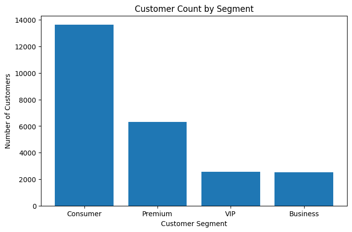
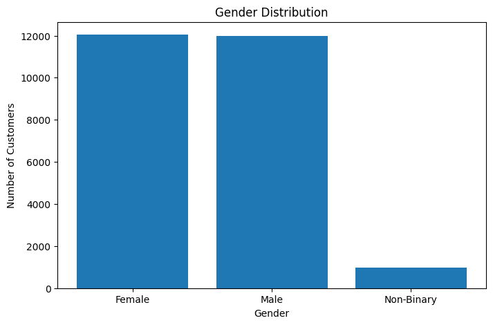
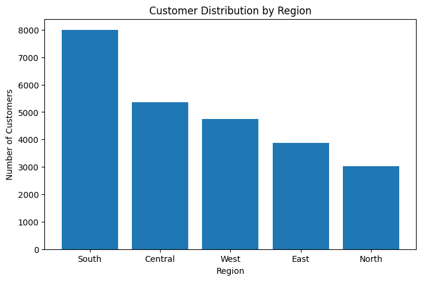
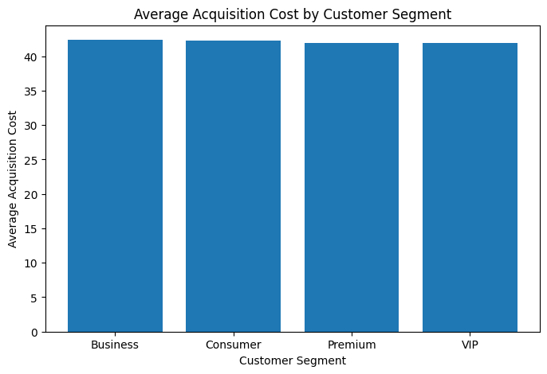

# 🛒 E-Commerce Customer Analytics with PySpark

## 📌 Project Overview

This project analyzes 25,000 e-commerce customers using PySpark on Databricks. The goal is to answer three business questions: **who are the customers** (segments, demographics), **where are they** (region, state, city, country), and **what does it cost to acquire them** (acquisition cost by segment and region).

The project covers the full workflow: data inspection and cleaning, feature engineering, customer analysis with PySpark and Spark SQL, Delta Lake storage, partitioning, and visualization.

## 📊 Dataset

[E-Commerce Sales Analytics Dataset](https://www.kaggle.com/datasets/datascikhan/e-commerce-sales-and-customer-analytics/data) (Kaggle)

## 🛠️ Technologies

* Python
* PySpark / Apache Spark
* Databricks
* Spark SQL
* Delta Lake
* Matplotlib

## 🔄 Project Workflow

1. Load the dataset into Databricks
2. Inspect the schema and data quality
3. Check for duplicates and missing values
4. Create age groups and acquisition cost categories
5. Perform customer analysis using PySpark
6. Apply aggregations and window functions
7. Perform analysis using Spark SQL
8. Store the processed data as a Delta table
9. Partition the data by `region`
10. Visualize key analytical results
11. Summarize the main findings

## 🧹 Data Quality

The dataset was checked for duplicate rows and missing values. **No duplicates and no null values were found**, so no cleaning was needed before analysis.

## 🔍 Customer Analysis

* Customer segment distribution
* Gender distribution
* Age groups
* Average age by customer segment
* Average acquisition cost by customer segment
* Customer distribution by region
* Average acquisition cost by region
* Customer distribution by city, state, and country
* Acquisition cost categories
* Customer ranking by acquisition cost (window functions)
* Customer segment and gender distribution

## ⚡ Spark Concepts

* **DataFrames, schema and data types:** inspecting and casting columns
* **`select()`, `filter()`, `withColumn()`:** cleaning and creating age group and cost category features
* **`groupBy()`, aggregations, `orderBy()`:** segment, region, and geography summaries
* **Window functions:** ranking customers by acquisition cost
* **Temporary views and Spark SQL:** re-running the analysis in SQL
* **Delta tables and partitioning:** storing results and querying by `region`

## 💾 Data Storage

The final customer analysis DataFrame was stored as a Delta table in Databricks. The data was partitioned by `region`, and the table was queried with a region filter so Spark reads only the matching partition instead of scanning the whole table.

## 📈 Visualizations

**Customer Count by Segment**



**Gender Distribution**



**Customer Distribution by Region**



**Average Acquisition Cost by Customer Segment**



## 🔑 Key Findings

* **Consumer is the largest segment** with 13,638 customers (54.6% of 25,000), followed by Premium (6,301, 25.2%), VIP (2,542, 10.2%), and Business (2,519, 10.1%).
* **The USA dominates the dataset** with 14,925 customers (59.7%).
* **Gender is balanced among USA customers:** 7,191 Female, 7,150 Male, and 584 Non-Binary.
* **Business customers are the oldest**, averaging about 46.63 years.
* **Business customers have the highest average acquisition cost** among customers with acquisition costs above 50, averaging about 65.42.
* **Business is the smallest segment** (about 10% of customers) while having the highest average age and the highest average acquisition cost among customers with acquisition costs above 50.
* The final data was stored as a Delta table partitioned by `region`.

## 🚀 How to Run

1. Download the dataset from Kaggle (link above).
2. Create a Databricks workspace and cluster.
3. Upload the data file and update the path in the first notebook cell.
4. Import `ecommerce_customer_analytics.ipynb` and run all cells.

## 📁 Project Files

```text
E-Commerce-Customer-Analytics-PySpark/
│
├── ecommerce_customer_analytics.ipynb
├── README.md
├── customer_count_by_segment.png
├── gender_distribution.png
├── customer_distribution_by_region.png
└── average_acquisition_cost_by_segment.png
```
